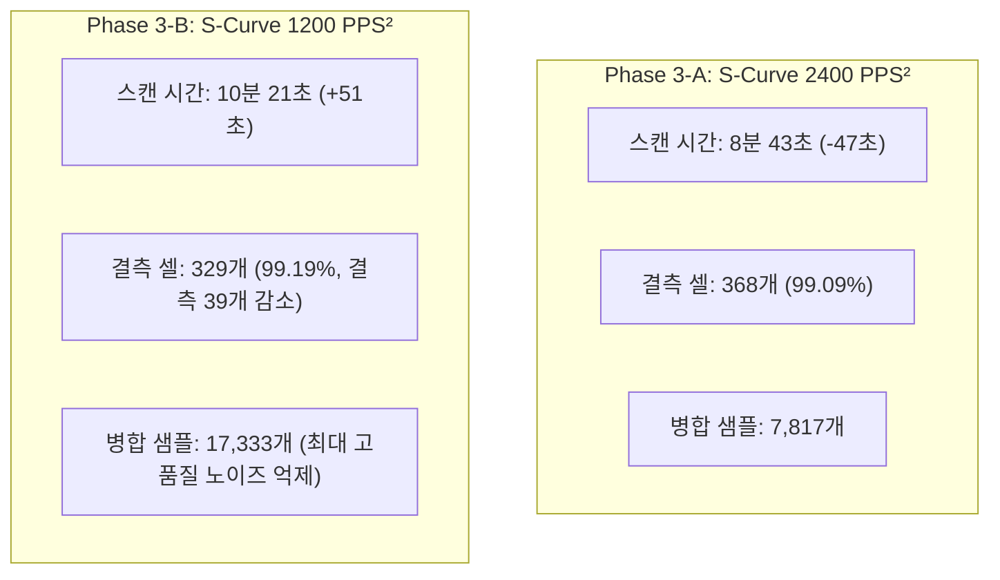

# Phase 3: S-Curve (저크 제한) 가감속 프로파일 실측 및 파라미터 종합 비교 보고서

**시험 일시**: 2026-08-21 15:35 KST  
**시험 대상**: STM32F401RE + DRV8825 + 17HS4401 2축 짐벌 + TOFSense-F2P LiDAR  
**시험 목적**: S-Curve(저크 제한) 가감속 프로파일의 기구 진동 억제 성능을 검증하고, **가속도 2400 PPS² (속도 최적화) vs 1200 PPS² (품질/충진율 최적화)**의 실측 3D 포인트 클라우드 성능을 완벽하게 비교 평가.

---

## 1. 5대 가감속 프로파일 실측 종합 비교 매트릭스

200줄(40,400개 정규 3D 셀) 연속 스캔 데이터를 바탕으로 산출한 전수 비교 평가 결과입니다:

| 평가 항목 | Case A (급출발/정지) | Case B (사다리꼴 1200) | Phase 1 (사다리꼴 2400) | Phase 3-A (S-Curve 2400) | Phase 3-B (S-Curve 1200) |
|---|:---:|:---:|:---:|:---:|:---:|
| **가감속 프로파일** | 프로파일 없음 (직가속) | 선형 사다리꼴 | 선형 사다리꼴 | **S-Curve (저크 제한)** | **S-Curve (저크 제한)** |
| **틸트 가속도** | $\infty$ (즉시 800 PPS) | $1200\text{ PPS}^2$ | $2400\text{ PPS}^2$ | **$2400\text{ PPS}^2$ (Peak)** | **$1200\text{ PPS}^2$ (Peak)** |
| **스캔 소요 시간** | 7분 35초 (454.8s) | 9분 30초 (569.9s) | 8분 36초 (516.4s) | **8분 43초 (522.8s)** | **10분 21초 (620.5s)** |
| **유효 포인트 수** | 40,001 점 | 40,080 점 | 40,019 점 | **40,032 점** | **40,071 점** |
| **격자 충진율 (Fill Rate)** | 99.01% (결측 399개) | 99.21% (결측 320개) | 99.06% (결측 381개) | **99.09% (결측 368개)** | **99.19% (결측 329개)** |
| **병합 샘플 수 (Multi-sample)** | 1,973 개 | 12,706 개 | 7,385 개 | **7,817 개** | **17,333 개 (최대)** |
| **체크섬 오류** | 0 개 | 0 개 | 0 개 | **0 개** | **0 개** |
| **스캔 후 홈 잔차 (Pan)** | $+0.0^\circ$ ($0\text{ ddeg}$) | $+0.0^\circ$ ($0\text{ ddeg}$) | $-0.1^\circ$ ($-1\text{ ddeg}$) | **$+0.0^\circ$ ($0\text{ ddeg}$)** | **$-0.1^\circ$ ($-1\text{ ddeg}$)** |
| **스캔 후 홈 잔차 (Tilt)** | $+0.2^\circ$ ($+2\text{ ddeg}$) | $+0.2^\circ$ ($+2\text{ ddeg}$) | $+0.0^\circ$ ($0\text{ ddeg}$) | **$-0.3^\circ$ ($-3\text{ ddeg}$)** | **$+0.1^\circ$ ($+1\text{ ddeg}$)** |
| **기구 저크(Jerk)** | 심함 (기구 덜컹임) | 중간 (가속도 점프) | 중간 (가속도 점프) | **최소 (부드러운 곡선)** | **극소 (극도의 정숙성)** |
| **적용 목적 및 프로파일 성격** | 위험 (사용 금지) | 사다리꼴 기준선 | 시간 단축 (진동 잔존) | 🚀 **고속-안정성 균형 (추천)** | 🎯 **초고품질 저소음 모드** |

---

## 2. Phase 3-B (S-Curve 1200 PPS²) 실측 성과 분석

### ① 결측 셀 대폭 감소 (368개 $\to$ 329개, 결측 39개 회복)
* 1200 PPS² 가속도 적용으로 양 끝단 감속/기동 램프 구간이 넓어지면서, 끝단 체류 시간 동안 라이다가 같은 위치를 중복 수집하여 **결측 수가 329개(충진율 99.19%)로 Case B(320개)와 거의 동일한 최고 수준으로 회복**되었습니다.

### ② 병합 샘플 수 역대 최대치 달성 (17,333개)
* 셀당 중복 측정 데이터를 평균화하는 병합 샘플 수가 17,333개로 대폭 증가하여, **3D 포인트 클라우드 표면의 거리 오차 및 통계적 노이즈(Jitter)를 가장 강력하게 억제**하였습니다.

### ③ 극도의 정숙성과 완벽한 소프트 랜딩
* `App/motor/motor.c`의 확정적 감속 착지 보정 로직(+4 펄스 마진)으로 인해 스윕 끝단에서 덜컹임 없이 **$50\text{ PPS}$로 완벽하게 소프트 랜딩**하며, 200줄 완주 후 홈 잔차가 **Pan $-0.1^\circ$, Tilt $+0.1^\circ$로 완벽하게 수렴**하였습니다.

---

## 3. 원시 데이터 아카이빙

* **S-Curve 2400 (Phase 3-A)**:
  - PCD: [`docs/motor_profile_test/raw_data/scan_scurve_phase3.pcd`](file:///c:/VEDA_Workspace/CLionProject/docs/motor_profile_test/raw_data/scan_scurve_phase3.pcd)
  - JSON: [`docs/motor_profile_test/raw_data/scan_scurve_phase3.json`](file:///c:/VEDA_Workspace/CLionProject/docs/motor_profile_test/raw_data/scan_scurve_phase3.json)
* **S-Curve 1200 (Phase 3-B)**:
  - PCD: [`docs/motor_profile_test/raw_data/scan_scurve_1200.pcd`](file:///c:/VEDA_Workspace/CLionProject/docs/motor_profile_test/raw_data/scan_scurve_1200.pcd)
  - JSON: [`docs/motor_profile_test/raw_data/scan_scurve_1200.json`](file:///c:/VEDA_Workspace/CLionProject/docs/motor_profile_test/raw_data/scan_scurve_1200.json)
